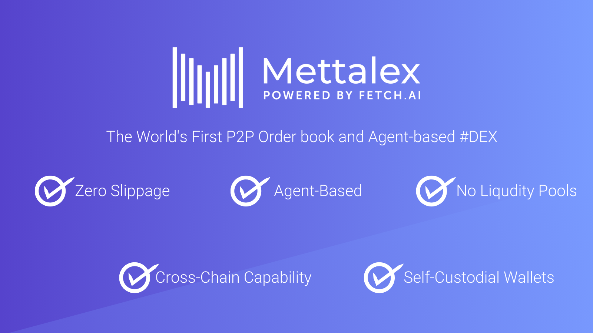
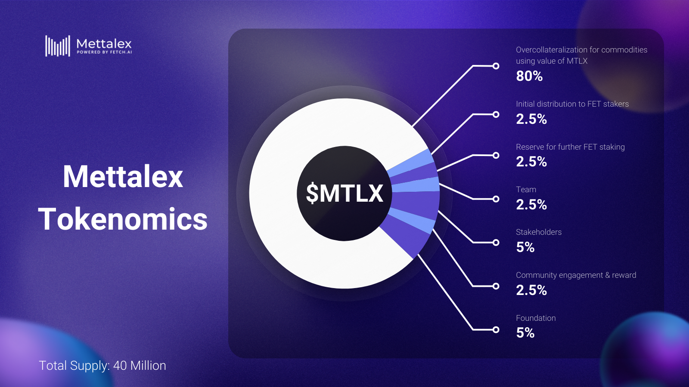

# Fetch Community Community Pool Proposal

### EXECUTIVE  SUMMARY

Mettalex stands out in the DeFi landscape by merging [Fetch.ai](http://fetch.ai/)'s cutting-edge AI agent technology with a peer-to-peer order book approach, creating a unique decentralized exchange (DEX) that eliminates the need for traditional liquidity pools. This innovation enables seamless, zero-slippage transactions across multiple chains without requiring a bridge for digital assets, including cryptocurrencies and commodities.

**Mettalex is requesting of a 1 million USD grant in $FET tokens from the [Fetch.ai](http://fetch.ai/) community fund** aims to further develop Mettalex Platform and launch a mainnet beta on Q4’2024, expand marketing efforts, and enhance liquidity for $MTLX, reinforcing its mission to advance DeFi trading through technology.

Mettalex commits to repaying the [Fetch.ai](http://fetch.ai/) community fund with profits from trading fees and other revenues. Repayment will start once specific revenue milestones are met, highlighting our dedication to transparency and mutual growth within the [Fetch.ai](http://fetch.ai/) ecosystem.

### **APPLICANT INFORMATION**

**Applicant Name:** Humayun Sheikh or Chirag or Monish or Mehul

**Project Name:** Mettalex: P2P order book and Agent based DEX

**Project Description:** Mettalex is a decentralised exchange (DEX) offering innovative peer-to-peer order book trading and AI agent technology for zero-slippage transactions across various blockchains.

**Funds Requested:** We are requesting 1Million USD worth of $FET Token, based on the current price of $2.55 per FET on Uniswap FET/USDT Pair as of April 11, 2024, at 5:35 PM UTC. This is total of 392156.8 $FET

**Team Members and Roles:** [https://x.com/Mettalex/status/1738633869057028527?s=20](https://x.com/Mettalex/status/1738633869057028527?s=20)

- **Humayun Sheikh** - CEO and Co-Founder
- **Maria Minaricova -** Business Development
- **Chirag Maliwal -** Project Manager
- **Mehul Gaidhani-**  Technical Product Lead
- **Monish -** Marketing Manager
- **Manish Singh -** Senior Front-end Developer
- **Depeesh Bhavsar -** Senior Full stack Developer
- **Devendra** - Smart Contract Engineer
- **Vishnu Gour -** DevOps

**Project Links:** [https://linktr.ee/mettalex](https://linktr.ee/mettalex)

- Website: [Mettalex.com](http://mettalex.com/)
- Twitter: @mettalex
- Telegram: [https://t.me/mettalex_official](https://t.me/mettalex_official)
- LinkedIn: [https://www.linkedin.com/company/mettalex](https://www.linkedin.com/company/mettalex)
- Youtube:[https://www.youtube.com/@Mettalex_dex](https://www.youtube.com/@Mettalex_dex)
- Medium : [https://medium.com/mettalex](https://medium.com/mettalex)

**Contact Information**

- Point of Contact: Chirag or Monish
- TG handle: @MonishMuralidharan
- Email: info@mettalex.com

### **TEAM AND PRODUCT INFORMATION**

Led by Humayun Sheikh (CEO) and composed of experts in AI, blockchain, financial markets, and software development, our team is dedicated to advancing Mettalex and showcasing the potential of Fetch.ai's technology.

Mettalex began its journey as a commodity trading platform, aiming to leverage blockchain technology to democratize access to commodity markets and make trading more accessible and efficient. The initial vision was to provide traders, especially those outside the traditional financial ecosystems, with a platform to trade various commodities using tokenization, smart contracts, and decentralized finance (DeFi) principles.

As the DeFi space evolved, Mettalex recognized the limitations and challenges posed by traditional liquidity pool-based DEXs, such as slippage, impermanent loss, and liquidity provision complexities. To address these issues and further its mission of creating a more inclusive and efficient trading environment, Mettalex embarked on an ambitious transformation. The platform shifted its focus from solely commodity trading to becoming a peer-to-peer (P2P) decentralized exchange that incorporates advanced AI agent technology powered by Fetch.ai.

**What novelty or innovation does Mettalex bring to [Fetch.ai](http://fetch.ai/) ?**

Mettalex introduces a revolutionary approach to decentralized finance (DeFi) by integrating [Fetch.ai](http://fetch.ai/)'s autonomous agent technology into a peer-to-peer order book DEX. This innovation allows for zero-slippage trading across a variety of assets, including cryptocurrencies and commodities. The platform's AI agents automate trading, offering precision and efficiency not seen in traditional DeFi platforms. By eliminating the need for liquidity pools, Mettalex provides a seamless trading experience, making it a unique and forward-thinking application of [Fetch.ai](http://fetch.ai/)'s capabilities within the blockchain ecosystem.

- **No Liquidity Pools**: Unlike conventional DEXs, Mettalex operates without liquidity pools, eradicating slippage and making trading more efficient.
- **AI Agent-Based DEX**: Leveraging Fetch.ai technology, Mettalex utilizes autonomous agents for smarter, automated trading, enhancing the trading experience with precision and reducing manual intervention.
- **Cross-Chain Capabilities**: Mettalex offers seamless trading across different blockchains, enabling users to trade a wide range of assets without being limited to a single chain, thereby increasing accessibility and flexibility for traders.

Checkout the series of blogs as well as monthly updates here: [https://docs.mettalex.com/blog/](https://docs.mettalex.com/blog/)

**How do we Measure Mettalex success?**

At Mettalex, we measure our platform's success and user satisfaction through a set of carefully selected metrics.

- Daily Active User
- Trading Volume
- Fee Income
- No. of Trades
- No. of Contracts / Agents Deployed
- Open Interest

### **PROTOCOL DETAILS**

**Is Mettalex Native to Fetch Blockchain:** 
Mettalex fully integrates Fetch.ai's pioneering technologies at its core, making the platform a native and integral part of the Fetch.ai ecosystem. This intrinsic use of Fetch.ai's capabilities allows Mettalex to deliver an unparalleled trading experience, featuring automated, efficient, and secure transactions through the innovative use of autonomous agents.

Please find the FetchTech used by Mettalex: [https://x.com/Mettalex/status/1735543324331937857?s=20](https://x.com/Mettalex/status/1735543324331937857?s=20)

Designed with flexibility in mind, Mettalex stands out as a **chain-agnostic platform**, facilitating seamless cross-chain trading functionalities. This approach enables users to effortlessly trade across various blockchains, significantly expanding the scope of assets available for trading and enhancing the platform's accessibility and utility.

**When is Deployment Date:** The official launch date for Mettalex on the Fetch blockchain is to be announced, marking a significant milestone in the platform's development and its contribution to the broader DeFi ecosystem. Currently Mettalex is running on Dorado Testnet of Fetch and will be open to Private beta soon.

Demo Video: [https://youtu.be/l0ym9gOrGFw?feature=shared](https://youtu.be/l0ym9gOrGFw?feature=shared)

**Tokenomics:** Mettalex utilizes its native token, $MTLX, as a fundamental component of its ecosystem. The token plays a crucial role in facilitating trades, governance, and incentivizing participation within the platform. For comprehensive details on $MTLX's utility and distribution, 

please refer to our [tokenomics documentation](https://docs.mettalex.com/docs/MTLX%20Token/MTLXTokennomics).

**Past and Current Incentivization:** The First version of Mettalex has various incentivisation program which led to mass user adoption of platform. Today the Revamped Mettalex has not implemented specific liquidity mining or incentive programs. The platform's focus remains on developing a robust, user-centric trading environment, with future plans to explore incentivization strategies that align with our community's interests and the platform's long-term sustainability.

**Audit History:** Mettalex places a high priority on security and trustworthiness. Our platform and its underlying smart contracts have undergone comprehensive audits by reputable security firms.Although the MTLX token remains unchanged from its previous version, we continue to rely on the existing audit report to validate its security. In addition to these audits, we plan to maintain an active bug bounty program to encourage the community and security researchers to help us identify and fix potential vulnerabilities.

Token contract Audit : [https://skynet.certik.com/projects/fetch.ai?auditId=fetch.ai-metalx#code-security](https://skynet.certik.com/projects/fetch.ai?auditId=fetch.ai-metalx#code-security)

**Security Incidents:** Mettalex is proud to report that there have been no major security incidents affecting our platform. This record underscores our commitment to maintaining the highest standards of security and reliability for our users, ensuring a safe and secure trading environment.

### **GRANT INFORMATION**

### Requested Grant Size

We are seeking a grant of 1 million USD worth of FET tokens. This significant investment in Mettalex is envisioned to catalyse the next phase of our development, focusing on product refinement, market expansion, and liquidity enhancement.

### Justification for Grant Size

The allocation of the grant is meticulously planned to ensure balanced growth across critical areas of our project. Here’s a breakdown of the fund allocation and its intended impact:

- **Software Development (40%):** A substantial portion of the grant, equating to $400,000 USD worth of FET tokens, will be dedicated to software development. This funding will fuel the advancement of our unique peer-to-peer orderbook and AI Agent Based DEX, incorporating more sophisticated features like LLM integrated prompt based trading, improving system security, and ensuring seamless cross-chain functionalities. By investing heavily in our technology, we aim to solidify our foundation and prepare our platform for scalable growth.
    - **Team expansion:**
        - **Crypto Economist Hiring:** Dedicated funds will be allocated towards hiring a Crypto Economist. This role is essential for developing and refining Mettalex's crypto-economic models, ensuring the platform's sustainability and appeal. The Crypto Economist will focus on optimizing token utilities, incentives, and governance structures to enhance the ecosystem's value.
        - **Security Expert Hiring:** With a specific allocation towards security enhancements, hiring a dedicated security expert or consultant to oversee the platform's security architecture and conduct regular audits and penetration tests is crucial. This will ensure the platform's resilience against emerging security threats.
        - **UI/UX Designer:** A significant portion of the software development budget is dedicated to hiring a UI/UX designer. This role is crucial for ensuring the platform's user interface is intuitive, accessible, and provides a seamless user experience, which is essential for user retention and adoption.
        - **Smart Contract Developer and Software Testing Engineer:** These roles are critical for the development and maintenance of secure, efficient, and scalable smart contracts, as well as ensuring thorough testing of all software components to prevent bugs and vulnerabilities.
    - **Infrastructure Setup and Scalability**
        - **Cloud Infrastructure and Services:** A portion of the funds will be dedicated to setting up a resilient and scalable cloud infrastructure. This includes deploying services across multiple regions to ensure high availability and low latency for global users. We'll leverage leading cloud providers that offer scalable solutions to handle varying loads, ensuring that the Mettalex platform remains responsive and reliable as user numbers grow.
        - **Load Balancing and Auto-Scaling:** Implementation of load balancing solutions to distribute traffic evenly across servers and prevent any single point of failure. Auto-scaling capabilities will be integrated to automatically adjust resources in response to real-time demand, ensuring cost-effective scalability.
- **Marketing and Community Engagement (30%):** Approximately $300,000 USD worth of FET tokens will be allocated towards marketing and community engagement initiatives. This investment is crucial for building brand awareness, fostering a strong community presence, and driving user adoption. Activities will include targeted marketing campaigns, community events, AMAs, and partnership development. Our goal is to enhance our visibility within the DeFi ecosystem and attract a broader user base to Mettalex.
- **Liquidity Enhancement (30%):** The remaining $300,000 USD worth of FET tokens will be utilized for liquidity enhancement purposes. Strengthening the liquidity for our MTLX is essential for providing users with a superior trading experience, minimizing slippage, and ensuring the availability of diverse trading pairs. This funding will be used to incentivise liquidity provision to MTLX, thereby attracting more traders and enhancing overall market stability.

.png)

### Funding and Contract Addresses

- **Funding Address:** fetch1hlj4ealhhg7n75dmvtj6ynp9q3yeqhh02pclqx
- **Contract Address:**
    
    **MTLX (ERC20):**  0x5921DEE8556c4593EeFCFad3CA5e2f618606483b
    

### **GRANT OBJECTIVES, EXECUTION AND MILESTONES**

**Objectives:**At the heart of our mission lies the commitment to transform the DeFi landscape for our community. By leveraging cutting-edge AI technology, we aim to significantly improve the trading experience, broaden market access, and elevate the efficiency of transactions for all users on the Mettalex platform

**Execution Strategy:** 

**Software Development (40%)**

**Objective:** Enhance Mettalex's platform by introducing new features, improving existing functionalities, and ensuring a seamless and secure trading experience.

**Execution Strategy:**

- **Q2-Q3:** Focus on developing and integrating AI agent-based trading capabilities, including autonomous order matching and execution.
- **Q3-Q4:** Implement cross-chain functionality to support asset swaps across different blockchains, with an emphasis on Fetch.ai integration.
- **Milestones:**
    - Successful integration of AI agent technology.
    - Launch of cross-chain trading features.
    - Zero critical security incidents post-launch.
    - Security Audits

### **Marketing and Community Engagement (30%)**

**Objective:** Increase brand awareness, drive user adoption, and foster a strong, engaged community around Mettalex.

**Execution Strategy:**

- **Q2:** Launch a comprehensive marketing campaign, including social media promotion, influencer partnerships, and community events.
- **Q3:** Host AMAs, webinars, and workshops to educate potential users about Mettalex's unique offerings.
- **Q4:** Run targeted ads on crypto-focused platforms to attract traders and liquidity providers.

**Milestones:**

- Achieve increase in social media followers and engagement.
- Host educational events & conduct offline Events
- Attain growth in platform user base.

### **Liquidity Enhancement (30%)**

**Objective:** Improve the liquidity of MTLX to ensure efficient market operations and enhance user trading experience.

**Execution Strategy:**  The funds will be utilized to enhance liquidity and serve as a primary resource for market makers to stabilize the MTLX token over time, as well as supporting the assets listed on the Mettalex platform. This will also help us bringing in new assets on Mettalex platform.

**Milestones:** 

**Q2 2024 - Planning:** Analyze markets and publish a liquidity enhancement strategy.

**Q3 2024 - Initial Provision:** Increase MTLX liquidity in key markets to improve trading stability.

**Q3-Q4 2024 - Asset Collateralization:** Start collateralizing trading assets with $MTLX, adjusting based on market feedback.

**Q4 2024 - Engage Market Makers:** Partner with market makers to stabilize MTLX liquidity further.

Roadmap of the Product : [https://docs.mettalex.com/resources/roadmap](https://docs.mettalex.com/resources/roadmap)

Check out the current progress here: [https://docs.mettalex.com/blog/update_march](https://docs.mettalex.com/blog/update_march) 

.png)

**KPIs:** Key Performance Indicators include user growth, transaction volume, liquidity metrics, and community engagement levels. Success will be measured by increased platform adoption, enhanced trading activity, and positive community feedback.

**Grant Timeline and Milestones:**

- Q2 2024: Complete software development upgrades and launch initial marketing campaigns.
- Q3 2024: Achieve targeted liquidity levels for the MTLX Token and conduct a comprehensive platform audit.
- Q4 2024: Review platform performance against KPIs and adjust strategies as needed

**Why should this proposal should be passed and how will it benefit the fetch community**

This proposal merits approval for several reasons, each contributing significantly to the community's broader benefits and showcasing Mettalex's commitment to the Fetch.ai ecosystem. The proposal's passage will bring about the following advantages:

1. **Innovative Trading Solution**: Mettalex introduces an advanced DeFi trading platform that leverages Fetch.ai's autonomous agent technology, offering a unique, efficient, and zero-slippage trading experience. This innovation enhances the Fetch.ai ecosystem by providing a novel utility that attracts a diverse user base, from individual traders to institutional participants.
2. **Ecosystem Growth and Utility Expansion**: By enabling cross-chain trading capabilities, Mettalex significantly broadens the utility of Fetch.ai, encouraging interoperability within the blockchain space. This expansion not only attracts new users but also retains them, contributing to sustained ecosystem growth.
3. **Community Engagement and Feedback Loop**: The proposal includes plans for intensive community engagement and marketing efforts. These initiatives aim to not only promote Mettalex but also to foster a feedback loop where community insights help refine and improve the platform, ensuring it meets user needs and preferences.
4. **Strengthened Liquidity and Market Presence**: Allocating a portion of the grant towards liquidity enhancement ensures a robust trading environment. This improvement leads to increased transaction volumes and a more vibrant marketplace, directly benefiting token holders through enhanced asset value and trading opportunities.

**Plan to Return the Grants to the Treasury**:

Mettalex is committed to contributing back to the Fetch.ai treasury, ensuring a symbiotic relationship that benefits both parties in the long term. The plan includes:q

- **Revenue Sharing Mechanism**: A portion of the trading fees generated on the platform will be allocated to a revenue-sharing pool, specifically designed to reimburse the Fetch.ai treasury over time. This mechanism creates a continuous return stream, aligning Mettalex's success with the Fetch.ai community's benefit.
- **Scheduled Milestone Reports**: Mettalex will provide the community with transparent milestone reports detailing the platform's growth, revenue generated, and the specific amounts allocated towards repaying the grant. This transparency ensures the community is continually updated on the grant repayment progress.

### CONCLUSION

Concluding, this funding proposal from Mettalex to the [Fetch.ai](http://fetch.ai/) community is a stepping stone towards revolutionizing the DEX space with our AI Agent-based platform. With the requested 1 million USD worth of FET tokens, we plan to significantly improve development, marketing, and liquidity, reinforcing Mettalex's market presence and showcasing [Fetch.ai](http://fetch.ai/)'s technology. Our roadmap promises a future of innovative trading experiences, and with community support, we aim to foster growth and innovation within both ecosystems. This collaborative effort will pave the way for a thriving DeFi environment, benefiting traders and the wider blockchain community alike.

We are requesting 1Million worth of FET Token, At the current rate of $2.55 Per FET at 11 April 2024 11.05PM IST